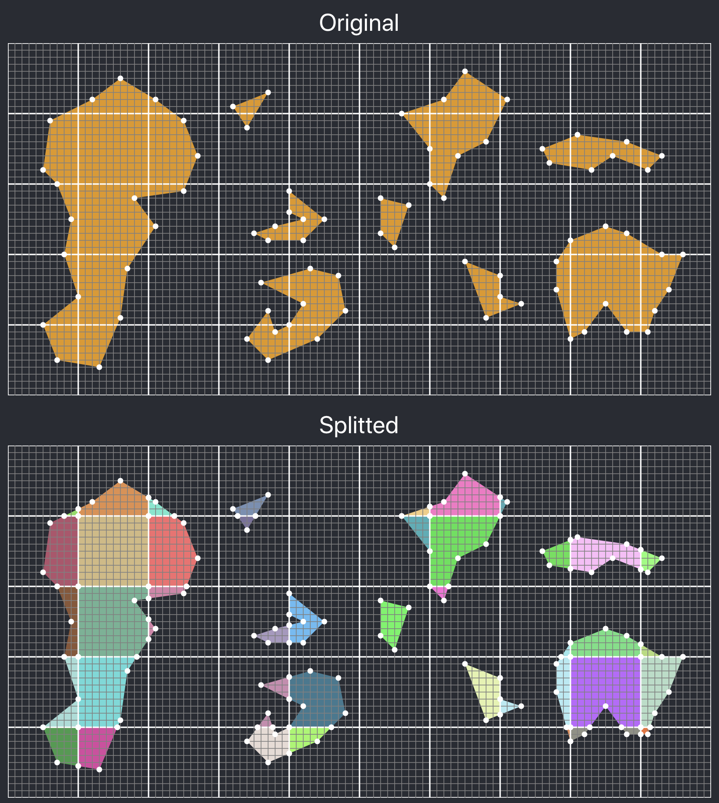
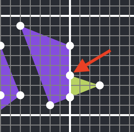

# geo-splitter

Some utils to split a GeoJSON file only containing Polygon type features into a collection of tiles

V1.0.1 only contains a function adapted to split polygon data



## Usage

Install geo-splitter

```
npm install geo-splitter
```

Use in your projects

```javascript
import geojsonSample from "./geojsonSample"; //Import your data
import split from "geo-splitter";

const xStart = 0;
const xEnd = 100;
const yStart = 0;
const yEnd = 50;
const gridSize = 10;
const bypassAnalysis = false; //(Default to false)

const splittedSample = split(
  geojsonSample,
  xStart,
  xEnd,
  yStart,
  yEnd,
  gridSize,
  bypassAnalysis
);
```

Once that ran, splittedSample will contain a collection of files that with polygons in different square areas of gridSize \* gridSize

It's recommended not to bypass analysis if you're not sure of you're data format.
Several contexts aren't supported yet, which will be detected by the pre-conversion analysis:

- Cannot convert anything else than Polygon type features (do not support MultiPolygon, Line, Point, ...)
- Cannot reliably convert polygons if they contain enclaves (if you're feature has more than 1 path, that may still have some pitfalls)
- Cannot convert polygons who contain several time the same point (except start and end points)

## Known issues

Conversion will fail if `xStart` or `yStart` aren't divisible by `gridSize`

## Algorithm

The process of splitting can be summarised in 3 main steps:

- Add extra points located add the frontier of 2 areas crossed by a segment of a polygon
- Create a collection of corner points that are strictly inside a polygon
- Assemble new polygons from parts of polygon path included in an area and corner points

## Reliability

In order to ensure reliability of those functions, another repo has been developed specificly to run tests and ensure every function returns the expected given different geometry contexts. You can clone and run locally [this client](https://github.com/BuckyDev/geo-splitter-test) to check the covered contexts.

## Vocabulary and definitions

### Points

#### Grid point

A point of a path which is on a gridline.

To know if a point is a grid point you therefore must know:

- The coordinates of gridlines (if the splitting grid is orthonormal, the grid size would be enough)
- The coordinates of the point

#### Interface point

A point of a path which:

- is a grid point (i.e is on a gridline )
- previous and following points are strictly on different sides of that gridline.

To know if a point is an interface point you therefore must know:

- The coordinates of gridlines (if the splitting grid is orthonormal, the grid size would be enough)
- The coordinates of the point
- The coordinates of the previous point
- The coordinates of the following point

By definition, all interface points are grid points

#### Split point

A point of a path which:

- is an interface point (i.e is on a gridline with previous and next points on different sides of the line)
- is on the line that links previous and following point (3 points are aligned and it's between both)

To know if a point is a split point you therefore must know:

- The coordinates of gridlines (if the splitting grid is orthonormal, the grid size would be enough)
- The coordinates of the point
- The coordinates of the previous point
- The coordinates of the following point

By definition, all split points are interface points

#### Bounce point

A point of a path which is on a gridline and where previous and following points are not grid points and are strictly on the same side of that gridline.

To know if a point is a bounce point you therefore must know:

- The coordinates of gridlines (if the splitting grid is orthonormal, the grid size would be enough)
- The coordinates of the point
- The coordinates of the previous point
- The coordinates of the following point

By definition, all bounce points are grid points

#### Mismatch point

This point represents a mismatch at the border between two parts of a split polygon that could break a merge process if not identified.



For instance in this picture, the mismatch point is part of the green polyogn, but not the purple one. Therefore the point should be re-introduced as an extra segment or the segments extracted for the merge process won't be able to be assembled.
